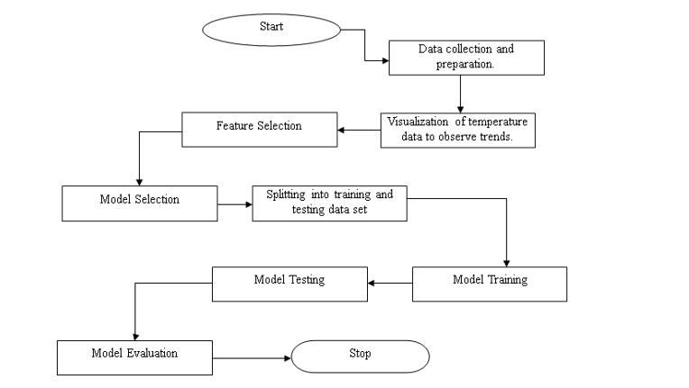

# ANN-Hyperparameter-Tuning

## Overview
The data set used for this work is the numerical monthly data set of the climatic variables of the United Kingdom. The aim of the work is to eventually predict the probability of heat wave occurrence. 
## Methodology

